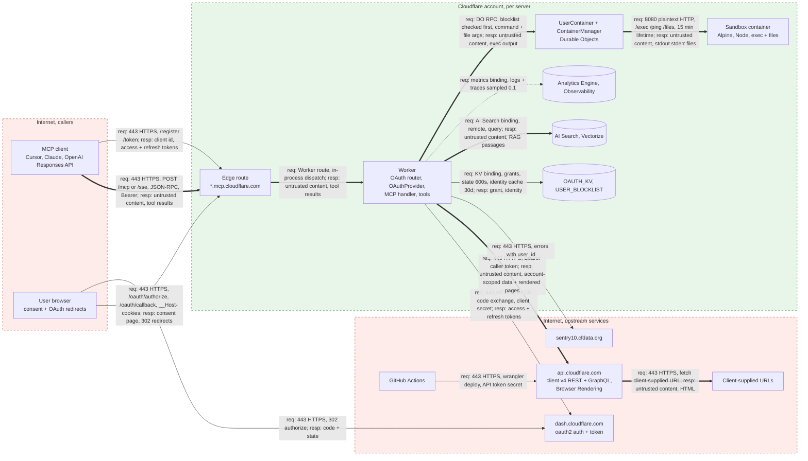

# Example, Step 1 System Decomposition

## 6. System Decomposition and MAESTRO Layer Mapping, cloudflare/mcp-server-cloudflare

Standalone Section 6, produced by `references/step1-system-decomposition.md` against the repository at commit 1d7a16b (2026-09-25). Every row cites the file and line it came from; `scripts/verify_citations.py` resolves all 91 citations and `scripts/check_decomposition.py` passes on the diagram. Anything the repository does not state is listed under 6.9, not assumed. No threats or mitigations appear here; those are Steps 2 to 4.

### 6.1 Scope and identity

Seventeen remote MCP servers, one Cloudflare Worker each, sharing one request pipeline from `packages/mcp-common`. Each Worker is stateless per request, serves Streamable HTTP at `/mcp` and `/sse`, and either requires a Cloudflare identity (fourteen servers) or is public (three). Authenticated servers act as an OAuth authorization server toward the MCP client and as an OAuth client toward `dash.cloudflare.com`, then call the Cloudflare v4 API with the user's token. One server (`sandbox-container`) additionally runs user-driven commands inside a container attached to a Durable Object. The LLM, prompt assembly and agent loop live in the MCP client, outside this repository.

| Server | Hostname | Auth | Notes |
|---|---|---|---|
| ai-gateway | ai-gateway.mcp.cloudflare.com | OAuth or API token | AI Gateway logs, prompts and responses |
| auditlogs | auditlogs.mcp.cloudflare.com | OAuth or API token | |
| autorag | autorag.mcp.cloudflare.com | OAuth or API token | |
| browser-rendering | browser.mcp.cloudflare.com | OAuth or API token | fetches arbitrary URLs through Browser Rendering |
| cloudflare-blog | blog.mcp.cloudflare.com | public | queries `search.blog.cloudflare.com` |
| cloudflare-one-casb | casb.mcp.cloudflare.com | OAuth or API token | |
| demo-day | demo-day.mcp.cloudflare.com | public | static assets binding |
| dex-analysis | dex.mcp.cloudflare.com | OAuth or API token | |
| dns-analytics | dns-analytics.mcp.cloudflare.com | OAuth or API token | |
| docs-ai-search | docs.mcp.cloudflare.com | public | AI Search instance `docs-mcp-rag` |
| graphql | graphql.mcp.cloudflare.com | OAuth or API token | `api.cloudflare.com/client/v4/graphql` |
| logpush | logs.mcp.cloudflare.com | OAuth or API token | |
| radar | radar.mcp.cloudflare.com | OAuth or API token | |
| sandbox-container | containers.mcp.cloudflare.com | OAuth or API token | Durable Objects plus container, `USER_BLOCKLIST` KV |
| stack-mcp | stack.mcp.cloudflare.com | public | AI Search namespace `dev-stack` |
| workers-bindings | bindings.mcp.cloudflare.com | OAuth or API token | AI Search and Vectorize bindings |
| workers-builds | builds.mcp.cloudflare.com | OAuth or API token | |
| workers-observability | observability.mcp.cloudflare.com | OAuth or API token | Sentry DSN in wrangler vars |

Hostnames from each app's `wrangler.jsonc` production `routes` (`"custom_domain": true`); auth mode from whether the app entry calls `createAuthenticatedMcpApp` or `createPublicMcpApp` (`packages/mcp-common/src/mcp-app.ts:52-86`).

### 6.2 Components

| Component | Runs where | Function | Evidence |
|---|---|---|---|
| Cloudflare edge route | Cloudflare edge, custom domain per server | TLS termination and ingress for `*.mcp.cloudflare.com` | `apps/workers-bindings/wrangler.jsonc:94` |
| OAuth router | Worker | Host and Origin allowlist on `/mcp` and `/sse`, then dev API-token mode or `OAuthProvider` | `packages/mcp-common/src/oauth-router.ts:58-121` |
| OAuthProvider (`@cloudflare/workers-oauth-provider`) | Worker | Authorization server for MCP clients: `/register`, `/oauth/authorize`, `/token`; validates its own bearer tokens on `/mcp` and `/sse`, falls back to `resolveExternalToken` for raw Cloudflare tokens | `oauth-router.ts:99-118`, `:109-111` |
| Cloudflare OAuth handlers | Worker (Hono) | Consent dialog, PKCE, state in KV, upstream redirect to `dash.cloudflare.com`, callback, token exchange, refresh | `packages/mcp-common/src/cloudflare-oauth-handler.ts:456-700`, `cloudflare-auth.ts:108,189,220` |
| API-token mode | Worker | Verifies a raw Cloudflare API or user token by probing `/client/v4/user` and `/accounts`, caches identity in KV by SHA-256 digest | `packages/mcp-common/src/api-token-mode.ts:34-88,134-146` |
| MCP handler and server factory | Worker | Per-request SDK v2 `McpServer`, 4 MB body cap, CORS, `410 Gone` for legacy `GET /sse` | `packages/mcp-common/src/server.ts:49-186` |
| Account manager | Worker | Chooses which Cloudflare account a call is scoped to (props, `cf-account-id` header, tool argument) | `packages/mcp-common/src/account-manager.ts:11,37,87` |
| Tool handlers | Worker | Per-product tools calling the Cloudflare v4 API with the caller's token | `packages/mcp-common/src/cloudflare-api.ts:41,54` |
| Docs search tools | Worker | Query AI Search instance `docs-mcp-rag` via binding | `packages/mcp-common/src/shared-tools/docs-ai-search.tools.ts:70,121` |
| Browser tools | Worker | `browserRendering.content.create` on the caller's account, URL supplied by the client | `apps/browser-rendering/src/tools/browser.tools.ts:35` |
| ContainerManager DO | Durable Object (SQLite class) | Tracks live containers, kills after 15 minutes | `apps/sandbox-container/server/containerManager.ts:23-49` |
| UserContainer DO | Durable Object (SQLite class) with attached container | Starts the container, proxies `/exec`, `/ping`, `/files/*` over TCP port 8080 | `apps/sandbox-container/server/userContainer.ts:11,75,88,108-167`, `containerHelpers.ts:81-83` |
| Sandbox container | Container image from `apps/sandbox-container/Dockerfile` | Node HTTP app on 8080 that runs `exec(execParams.args)` and reads/writes files | `Dockerfile:2,61,63`, `container/sandbox.container.app.ts:24-184` |
| Metrics tracker | Worker | Writes MCP request events (`userId`, `clientId`, protocol era) to Analytics Engine | `packages/mcp-observability/src/analytics-engine.ts:21`, `server.ts:87-93` |
| Sentry client (Toucan) | Worker | Captures 5xx-class errors, tags `user_id` | `packages/mcp-common/src/sentry.ts:33,38,62-63` |
| GitHub Actions | GitHub | Tests, Semgrep SAST, `wrangler deploy` to staging on `main` and production on release | `.github/workflows/main.yml:34-37`, `release.yml:63-66`, `semgrep.yml:30` |

### 6.3 Listening endpoints and ports

| Listener | Port and protocol | Path or method | Who reaches it | Auth | Evidence |
|---|---|---|---|---|---|
| Each Worker via edge route | 443 TCP, HTTPS | `POST /mcp`, `POST /sse` (alias), `OPTIONS` preflight | MCP clients, OpenAI Responses API, AI Playground | Bearer (OAuthProvider token or raw Cloudflare token) on authenticated servers; none on public servers | `oauth-router.ts:28,73-93`, `server.ts:147-149` |
| Same | 443, HTTPS | `GET /sse` | Legacy HTTP+SSE clients | none; answered `410 Gone` with migration body | `transport-migration.ts:9-38`, `server.ts:180-182` |
| Same | 443, HTTPS | `POST /register` (dynamic client registration), `GET /oauth/authorize`, `POST /oauth/authorize` (consent submit), `GET /oauth/callback`, `POST /token` | MCP clients and the user's browser | CSRF cookie on consent submit, state plus session cookie on callback | `oauth-router.ts:100-108`, `cloudflare-oauth-handler.ts:467-700` |
| Sandbox container app | 8080 TCP, plaintext HTTP, reachable only through the DO's `getTcpPort(8080)` | `GET /ping`, `GET /files/ls`, `GET /files/contents/*`, `POST /files/contents`, `DELETE /files/contents/*`, `POST /exec` | UserContainer DO only | none inside the container; caller was already authenticated by the Worker | `container/sandbox.container.app.ts:24-184`, `containerHelpers.ts:81-83`, `Dockerfile:61` |
| Local dev only | 8976 TCP, HTTP | wrangler dev | developer | optional `DEV_DISABLE_OAUTH=true` with a fixed `DEV_CLOUDFLARE_API_TOKEN` bypasses OAuth entirely | `apps/workers-bindings/wrangler.jsonc:35`, `api-token-mode.ts:149-179` |

Host header must be a service hostname or localhost; Origin, when present, must be a service hostname, localhost, or `playground.ai.cloudflare.com` (`mcp-app.ts:11,92-98`). CORS response header `Access-Control-Allow-Origin` defaults to `*` (`server.ts:277`), allowed request headers include `Authorization`, `cf-account-id`, `MCP-Protocol-Version` (`server.ts:115-123`).

### 6.4 Outbound connections

| From | To | Port and protocol | Purpose | Credential carried | Evidence |
|---|---|---|---|---|---|
| Worker | `dash.cloudflare.com/oauth2/auth` (browser redirect) and `/oauth2/token` | 443, HTTPS | Upstream OAuth authorize, code exchange, refresh | `CLOUDFLARE_CLIENT_ID` and `CLOUDFLARE_CLIENT_SECRET`, PKCE verifier | `cloudflare-auth.ts:108,189,220`, `oauth-router.ts:115-116` |
| Worker | `api.cloudflare.com/client/v4/user`, `/accounts` | 443, HTTPS | Identity probe for raw tokens and after code exchange | the caller's token as `Bearer` | `cloudflare-oauth-handler.ts:179-182` |
| Worker | `api.cloudflare.com/client/v4/accounts/{account}/...`, `/client/v4/graphql` | 443, HTTPS | Every product tool | the caller's OAuth access token or API token as `Bearer` | `cloudflare-api.ts:41,54` |
| Worker (browser server) | Browser Rendering via the v4 API, which then fetches the client-supplied URL | 443, HTTPS | Page content and screenshots | caller's token | `browser.tools.ts:35` |
| Worker (blog server) | `search.blog.cloudflare.com` | 443, HTTPS | Public blog search | none | `apps/cloudflare-blog/src/cloudflare-blog.context.ts:8` |
| Worker | Sentry `sentry10.cfdata.org` | 443, HTTPS | Error events with `user_id` | DSN | `apps/workers-observability/wrangler.jsonc:77`, `sentry.ts:38,63` |
| UserContainer DO | container, port 8080 | plaintext HTTP over the DO's container TCP port | exec and file operations | none | `userContainer.ts:88,108-167`, `containerHelpers.ts:83` |
| GitHub Actions | Cloudflare API via wrangler | 443, HTTPS | Deploy | `CLOUDFLARE_API_TOKEN` GitHub secret | `main.yml:36-37`, `release.yml:65-66` |
| Sandbox container | anything | not evidenced either way | commands run by `exec` may open sockets; no network policy in the repo | | `sandbox.container.app.ts:140` |

Platform bindings, not network sockets: `OAUTH_KV` and `USER_BLOCKLIST` (KV), `CONTAINER_MANAGER` and `USER_CONTAINER` (Durable Objects), `DOCS_AI_SEARCH` (AI Search, `remote: true`), `VECTORIZE`, `MCP_METRICS` (Analytics Engine), `AI` (bound in sandbox-container, unused in code), `ASSETS` (demo-day). `apps/workers-bindings/wrangler.jsonc:19-56`, `apps/sandbox-container/wrangler.jsonc:7-60`.

### 6.5 Data flows

| # | Flow | Protocol | Data | Control on the path | Evidence |
|---|---|---|---|---|---|
| 1 | MCP client to Worker `/mcp` | HTTPS 443, JSON-RPC 2.0 over Streamable HTTP | tool name, tool arguments (URLs, account ids, shell commands, file contents, queries), `MCP-Protocol-Version`, optional `cf-account-id` | Host and Origin allowlist, 4 MB body cap, bearer validation | `oauth-router.ts:73-93`, `server.ts:112,159-163` |
| 2 | Worker to MCP client | HTTPS 443, JSON-RPC result | tool output: Cloudflare API responses, rendered third-party pages, RAG passages, container stdout, stderr and files, server `instructions` suffix listing accounts | CORS headers only | `server.ts:72-78,263-286` |
| 3 | MCP client to Worker OAuth endpoints | HTTPS 443 | client metadata (DCR), `client_id`, `redirect_uri`, `state`, `code`, `code_verifier`, refresh token | exact resource match, redirect URI validated by provider | `oauth-router.ts:65-68,100-108`, `cloudflare-oauth-handler.ts:475-490` |
| 4 | Browser to Worker consent dialog | HTTPS 443, HTML form | approval decision, CSRF token | `__Host-CSRF_TOKEN` cookie, 600 s | `workers-oauth-utils.ts:639`, `cloudflare-oauth-handler.ts:514-529` |
| 5 | Worker to `dash.cloudflare.com/oauth2/auth` (via browser) | HTTPS 302 | `client_id`, PKCE `code_challenge`, scopes `user:read offline_access` (plus per-server scopes), state token | PKCE, state stored in KV for 600 s and bound to `__Host-CONSENTED_STATE` cookie | `cloudflare-oauth-handler.ts:418-450,504-509`, `workers-oauth-utils.ts:655,676`, `scopes.ts:2-5` |
| 6 | `dash.cloudflare.com` to Worker `/oauth/callback` | HTTPS 443 | authorization code, state | dual validation, KV state plus session cookie | `cloudflare-oauth-handler.ts:643-651` |
| 7 | Worker to `dash.cloudflare.com/oauth2/token` | HTTPS 443, form POST | code, `code_verifier`, client secret | client secret from Worker secret | `cloudflare-auth.ts:189-230` |
| 8 | Worker to `api.cloudflare.com` | HTTPS 443, REST and GraphQL | account-scoped product data both ways, user profile (`id`, `email`), account list (`id`, `name`) | caller's bearer token, account chosen by account manager | `cloudflare-api.ts:41,54`, `auth-props.ts:3-13`, `account-manager.ts:87` |
| 9 | Worker to `OAUTH_KV` | KV binding | grants and tokens (provider-managed), OAuth state with code verifier (600 s), identity cache `api-token-identity:v1:<sha256>` (30 days) | TTLs only | `oauth-router.ts:56`, `workers-oauth-utils.ts:643-655`, `api-token-mode.ts:34,59,79-81` |
| 10 | Worker to `USER_BLOCKLIST` | KV binding | Cloudflare user id lookup before container tools | blocklist gate | `apps/sandbox-container/server/container-tools.ts:42-44` |
| 11 | Worker to AI Search `docs-mcp-rag` | AI Search binding, `remote: true` | query string in, passages out | none stated | `docs-ai-search.tools.ts:70,121`, `apps/workers-bindings/wrangler.jsonc:44` |
| 12 | Worker to UserContainer DO to container | DO RPC, then HTTP on 8080 | `ExecParams.args` (client-supplied command string), file paths and contents, base64 files | 15-minute container lifetime, `MAX_CONTAINERS = 50`, `max_instances` per env | `userContainer.ts:84-90`, `containerManager.ts:41-45`, `containerHelpers.ts:1`, `sandbox-container/wrangler.jsonc:12` |
| 13 | Worker to Analytics Engine | binding | per-request event with `userId`, `clientId`, `protocolEra`, server name and version | none | `server.ts:87-93`, `analytics-engine.ts:21` |
| 14 | Worker to Workers Observability | platform | runtime logs and traces, traces head-sampled at 10 percent | none stated | `apps/workers-bindings/wrangler.jsonc:27-33` |
| 15 | Worker to Sentry | HTTPS 443 | exception with `user_id` on 5xx-class errors, suppressed when `reportToSentry === false` | none | `sentry.ts:22-38` |
| 16 | GitHub Actions to Cloudflare | HTTPS 443, wrangler | Worker bundles, container image, bindings config | `pnpm test`, `check:deps`, `check:format`, Semgrep before deploy | `main.yml:23-37`, `semgrep.yml:30` |

### 6.6 Data stores

| Store | Type | Holds | Lifetime | Encryption stated in repo |
|---|---|---|---|---|
| `OAUTH_KV` (one namespace per server per env) | Workers KV | OAuth grants and tokens written by `OAuthProvider`, `oauth:state:*` records with `codeVerifier`, `api-token-identity:v1:*` identity cache (`user`, `accounts`) | provider grants unstated in repo; state 600 s; identity cache 2,592,000 s | none |
| `USER_BLOCKLIST` | Workers KV | blocked Cloudflare user ids | unstated | none |
| ContainerManager DO storage | DO SQLite | container id to start time | deleted on kill or after 15 min | none |
| UserContainer DO plus container filesystem | DO SQLite, container disk | working directory files written by the client | container lifetime | none |
| AI Search `docs-mcp-rag`, namespace `dev-stack` | managed AI Search | docs and stack corpora | managed | none |
| Vectorize `docs-embeddinggemma-v1` | Vectorize | bound in `workers-bindings`, no code reads it | managed | none |
| Analytics Engine `mcp-metrics-{env}` | Analytics Engine | request events with user and client ids | unstated | none |
| Worker secrets | wrangler secrets | `CLOUDFLARE_CLIENT_ID`, `CLOUDFLARE_CLIENT_SECRET`, `MCP_COOKIE_ENCRYPTION_KEY` | until rotated | platform |
| Worker vars | `wrangler.jsonc` in git | `SENTRY_DSN` in three apps, `MCP_SERVER_NAME`, `MCP_SERVER_VERSION`, `ENVIRONMENT` | in repo | plaintext |

Evidence: `apps/workers-bindings/wrangler.jsonc:19-56`, `workers-oauth-utils.ts:643-655`, `api-token-mode.ts:34-88`, `containerManager.ts:23-45`, `apps/workers-bindings/CONTRIBUTING.md:35-39`, `apps/workers-observability/wrangler.jsonc:77`.

### 6.7 Credentials and cookies

| Credential | Issued by | Lifetime | Where it lives | Transport |
|---|---|---|---|---|
| MCP access token | Worker `OAuthProvider` | 3,600 s | `OAUTH_KV` (provider) and MCP client | `Authorization: Bearer` over HTTPS |
| MCP refresh token | Worker `OAuthProvider` | 2,592,000 s | `OAUTH_KV` and MCP client | `POST /token` |
| Cloudflare OAuth access and refresh token | `dash.cloudflare.com` | upstream-defined; refresh handled in `handleTokenExchangeCallback` | grant `props` in `OAUTH_KV` | sent as `Bearer` to `api.cloudflare.com` |
| Raw Cloudflare API token (`cfat_`, `cfoat_`, `cfut_`, or unprefixed) | Cloudflare dashboard | user-defined; account tokens cannot be refreshed | MCP client; identity cached in KV 30 days by digest | `Authorization: Bearer` direct to Worker, then pass-through to `api.cloudflare.com` |
| `__Host-MCP_APPROVED_CLIENTS` | Worker | 1 year | browser, HMAC-SHA256 signed with `MCP_COOKIE_ENCRYPTION_KEY` | `HttpOnly; Secure; SameSite=Lax` |
| `__Host-CSRF_TOKEN` | Worker | 600 s | browser | same attributes |
| `__Host-CONSENTED_STATE` | Worker | 600 s, cleared on callback | browser | same attributes |
| `CLOUDFLARE_CLIENT_SECRET`, `MCP_COOKIE_ENCRYPTION_KEY` | operator | until rotated | Worker secret | env binding |
| `CLOUDFLARE_API_TOKEN`, `CLOUDFLARE_ACCOUNT_ID` | operator | until rotated | GitHub Actions secrets | wrangler env |
| `DEV_CLOUDFLARE_API_TOKEN` with `DEV_DISABLE_OAUTH=true` | developer | dev only | `.dev.vars` | injected as props, OAuth bypassed |

Evidence: `oauth-router.ts:100-102`, `cloudflare-oauth-handler.ts:338-405`, `api-token-mode.ts:43-47,149-179`, `workers-oauth-utils.ts:5,37-87,601,639,676,769`.

### 6.8 Trust boundaries

| Boundary | Crossing | What enforces it in the repo |
|---|---|---|
| Internet to Worker | HTTPS 443 into the edge route | Host and Origin allowlist, bearer validation, 4 MB cap, `410` on legacy transport. No WAF, rate-limit, or bot rule in the repo |
| Worker to Cloudflare account data | HTTPS to `api.cloudflare.com` | the caller's own token and the account manager's account selection; the Worker holds no privileged Cloudflare credential of its own |
| Worker to upstream IdP | HTTPS to `dash.cloudflare.com` | PKCE, exact resource match, KV state plus session cookie, client secret |
| Worker to KV and DO | bindings | binding scope only |
| Worker to container | DO, then plaintext HTTP 8080 | blocklist, 15-minute lifetime, container count caps. Nothing in the repo constrains what the executed command can reach |
| Worker to third-party content | Browser Rendering fetch of a client-supplied URL, AI Search passages | none; content returns to the client as tool output |
| Repo to production | GitHub Actions | tests, Semgrep, `wrangler deploy` with a stored API token |

### 6.9 Not evidenced

- WAF, rate limiting, bot management or IP policy on `*.mcp.cloudflare.com`.
- Any egress policy from Workers or from the sandbox container; the container runs arbitrary `exec` with no network restriction in the repo.
- Encryption at rest for KV, DO storage, Vectorize, AI Search or Analytics Engine; how `OAuthProvider` stores grant `props` (library behaviour, not in the repo).
- Retention or immutability for Workers Observability logs, Analytics Engine, or Sentry.
- CPU, memory, disk or process limits on the sandbox container beyond instance counts and the 15-minute reaper.
- Rotation of `MCP_COOKIE_ENCRYPTION_KEY`, `CLOUDFLARE_CLIENT_SECRET`, or the GitHub deploy token.
- Per-server OAuth scopes beyond `user:read offline_access` were not enumerated here; each app passes its own scope map to `createAuthenticatedMcpApp`.

### 6.10 Network diagram

### 6.11 MAESTRO component-to-layer mapping

| Component | MAESTRO layer (domain) | Zone | Evidence bucket |
|---|---|---|---|
| Cloudflare edge route `*.mcp.cloudflare.com` | L1 Infrastructure (D1) | B2 | evidenced `apps/workers-bindings/wrangler.jsonc:94` |
| Firewall, WAF, rate limiting at the edge; egress policy from Workers and container | L1 Infrastructure (D1) | B1 to B2, B3 to B1 | required by network diagram spec, unevidenced |
| `OAUTH_KV`, Wrangler secrets | L1 Infrastructure (D1), secret storage | B4 | evidenced `apps/workers-bindings/wrangler.jsonc:19-21`, `apps/workers-bindings/CONTRIBUTING.md:38-39` |
| Prompt assembly, inference endpoint (inside the MCP client) | L2 Cognitive Core (D1) | B1 callers | inferred from `README.md:3`, [[unevidenced]] |
| Docs search tools, AI Search `docs-mcp-rag`, namespace `dev-stack` | L3 Data, Memory, Knowledge (D1) | B3, B4 | evidenced `packages/mcp-common/src/shared-tools/docs-ai-search.tools.ts:70,121` |
| Vectorize `docs-embeddinggemma-v1` | L3 Data, Memory, Knowledge (D1) | B4 | evidenced `apps/workers-bindings/wrangler.jsonc:45-48`; no code path |
| MCP client agent runtime (Cursor, Claude, OpenAI Responses API) | L4 Orchestration (D2) | B1 callers | evidenced `README.md:3,50` |
| ContainerManager DO, UserContainer DO, sandbox container | L5 Deployment and Execution (D2) | B3 (zone inferred) | evidenced `apps/sandbox-container/server/containerManager.ts:23-49`, `apps/sandbox-container/Dockerfile:2,61,63` |
| GitHub Actions CI/CD | L5 Deployment and Execution (D2) | B1 upstream | evidenced `.github/workflows/main.yml:34-37` |
| MCP handler and server factory, tool handlers, browser tools | L6 Tools and Ecosystem (D2) | B3 | evidenced `packages/mcp-common/src/server.ts:49-186`, `apps/browser-rendering/src/tools/browser.tools.ts:35` |
| `api.cloudflare.com`, Browser Rendering, third-party web pages | L6 Tools and Ecosystem (D2) | B1 upstream | evidenced `packages/mcp-common/src/cloudflare-api.ts:41` |
| Client tool-call policy | L6 Tools and Ecosystem (D2) | B1 callers | required by network diagram spec, unevidenced |
| OAuthProvider, Cloudflare OAuth handlers, API-token mode, account manager | L7 Identity and Autonomy (D3) | B3 | evidenced `packages/mcp-common/src/oauth-router.ts:99-118`, `packages/mcp-common/src/api-token-mode.ts:134-146`, `packages/mcp-common/src/account-manager.ts:87` |
| `dash.cloudflare.com/oauth2` | L7 Identity and Autonomy (D3) | B1 upstream | evidenced `packages/mcp-common/src/cloudflare-auth.ts:108,189` |
| OAuth router request policy (Host, Origin, CORS, 4 MB cap) | L8 Safety and Security (D3) | B3 | evidenced `packages/mcp-common/src/oauth-router.ts:73-84`, `packages/mcp-common/src/server.ts:112` |
| Metrics tracker, Analytics Engine, Workers Observability, Sentry client, Sentry | L9 Monitoring and Observability (D3) | B3, B5, B1 upstream | evidenced `packages/mcp-observability/src/analytics-engine.ts:21`, `apps/workers-bindings/wrangler.jsonc:27-31`, `packages/mcp-common/src/sentry.ts:62-63` |
| `USER_BLOCKLIST` check and KV | L10 Governance (D3) | B3, B4 | evidenced `apps/sandbox-container/server/container-tools.ts:42`, `apps/sandbox-container/wrangler.jsonc:55` |

- L1: edge route, OAUTH_KV, Wrangler secrets; firewalls and egress policy required, unevidenced
- L2: prompt assembly and inference endpoint, inferred, inside the MCP client
- L3: docs search tools, AI Search, Vectorize
- L4: MCP client agent runtime
- L5: Durable Objects, sandbox container, GitHub Actions
- L6: MCP handler and tools, Cloudflare API, Browser Rendering, third-party pages; client tool-call policy required, unevidenced
- L7: OAuthProvider, OAuth handlers, API-token mode, account manager, dash.cloudflare.com
- L8: request policy
- L9: metrics tracker, Analytics Engine, Workers Observability, Sentry
- L10: USER_BLOCKLIST
